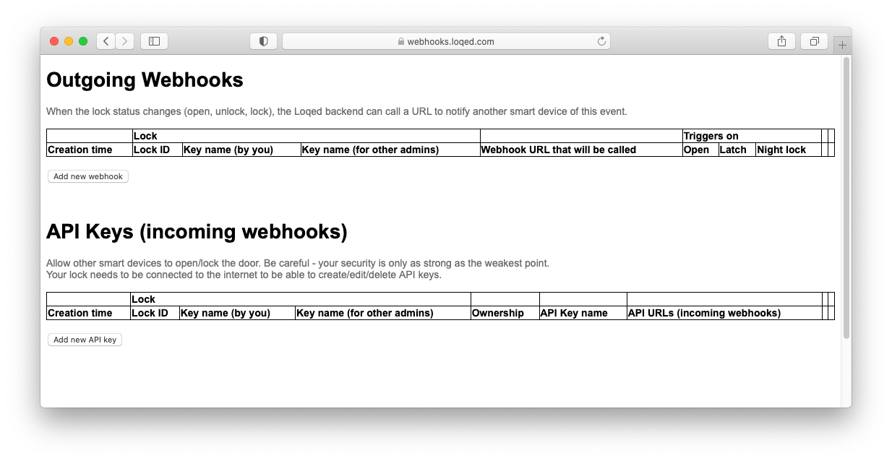
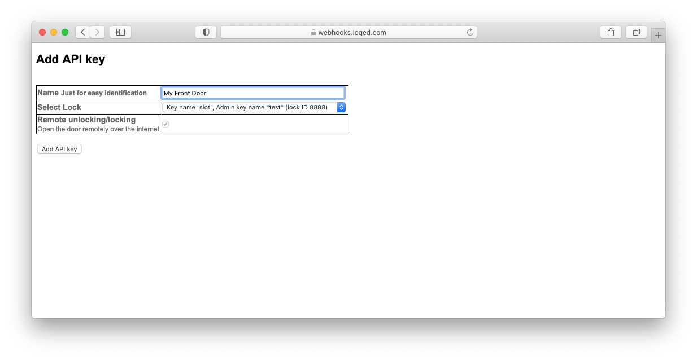
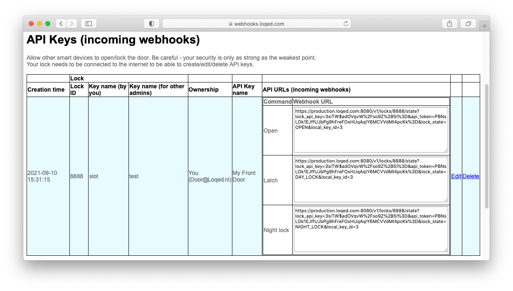
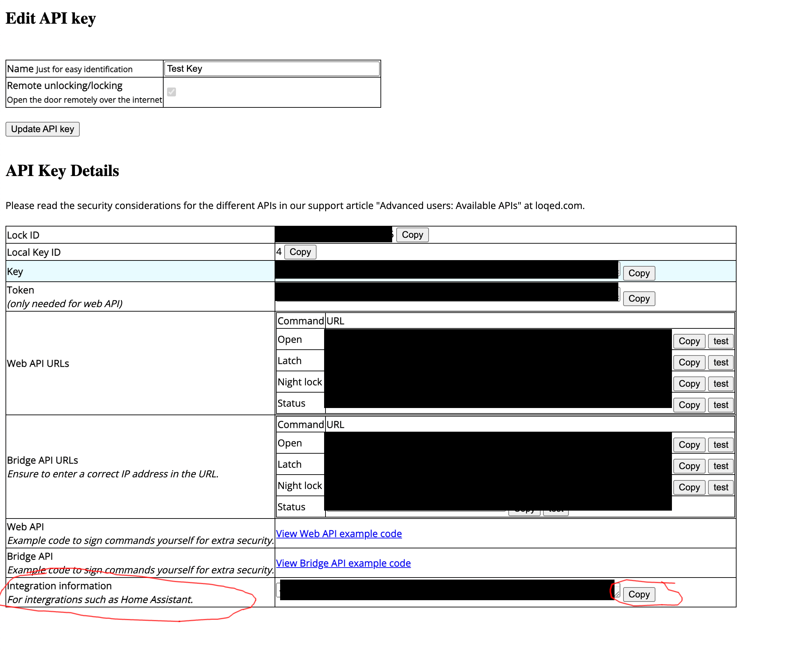

# Loqed

The `Loqed` component is a Home Assistant custom component for integrating your [Loqed](https://loqed.com/) smart lock

## Installation

### Manual Installation

1. Copy the `loqed` folder into your custom_components folder in your hass configuration directory.
2. Restart Home Assistant.
3. Configure your Loqed lock through Configuration -> Integrations -> Add Integration.

### Installation with HACS (Home Assistant Community Store)

1. Ensure that [HACS](https://hacs.xyz/) is installed.
2. Search for and install the `Loqed` integration through HACS.
3. Restart Home Assistant.
4. Configure Loqed through Configuration -> Integrations -> Add Integration.

## Configuration

### Integration configuration

Creating an API Key (from [Loqed support](https://support.loqed.com/en/articles/6127856-loqed-local-bridge-api-integration))
First you need to create a new key on your LOQED Touch Smart Lock.

Open the page https://app.loqed.com/API-Config.

Log in using your email address and password that you use for logging into the LOQED app.


Click on "Add new API key".


Enter a name for easy identification. This can be anything you like.

If you have multiple locks, you can select the right lock in the dropdown menu right next to "Select Lock".

Click "Add API key".



You have now created the API key. Go to edit and click on the `Copy` button in the Integration configuration section


## State and attributes

**TODO**

## Debugging

It is possible to debug log the webhook calls and raw responses from the bridge API. This is done by setting up logging like below in configuration.yaml in Home Assistant. It is also possible to set the log level through a service call in UI.

```
logger:
  default: info
  logs:
    homeassistant.components.loqed: debug
```
